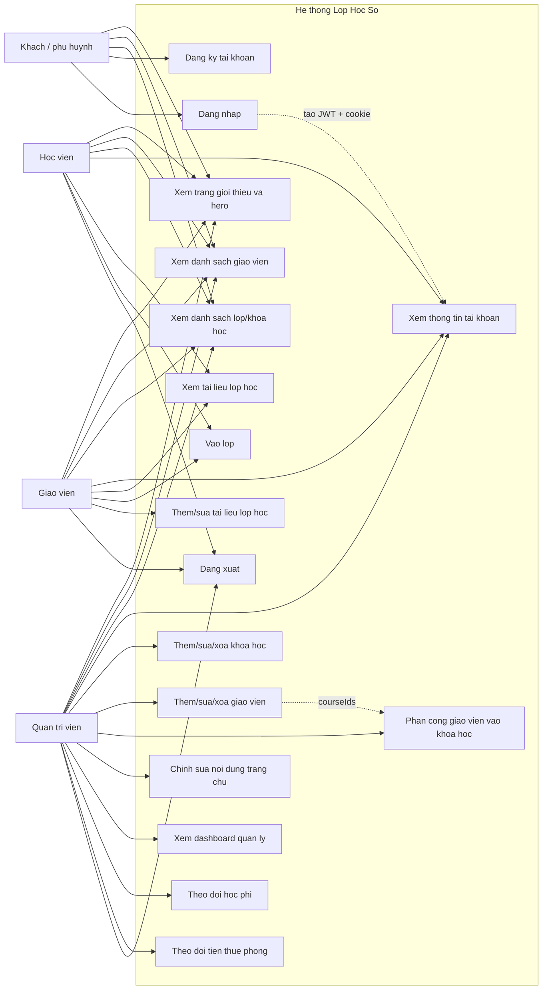
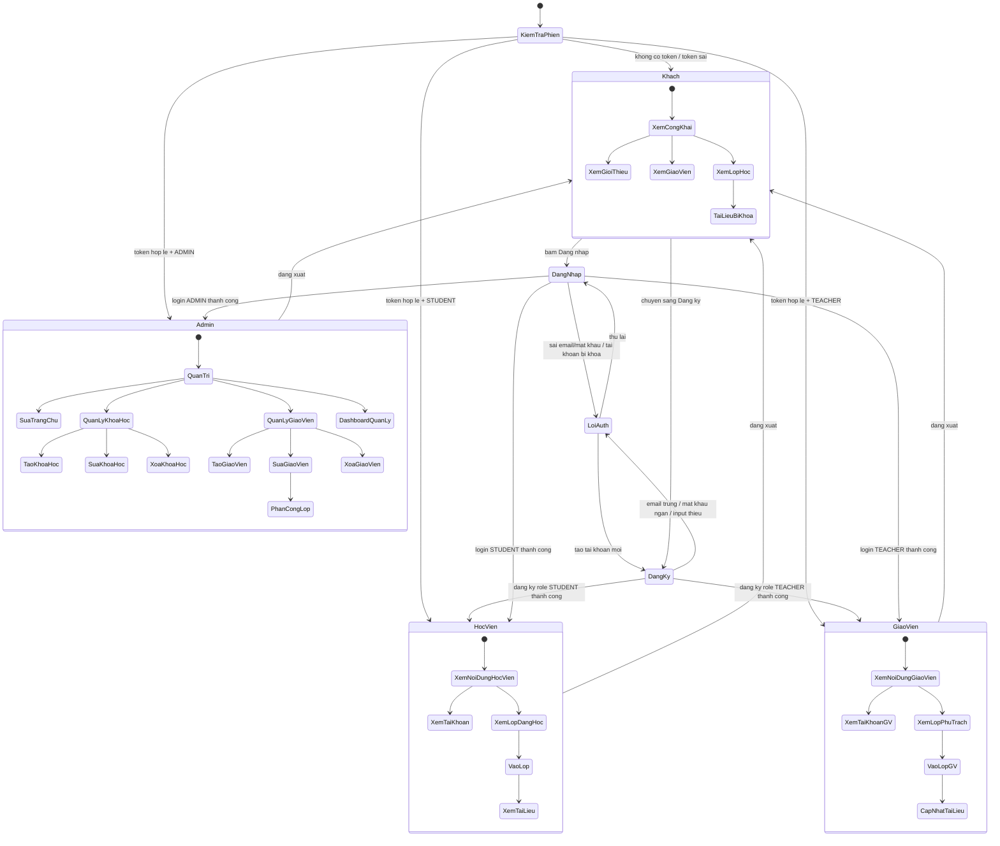
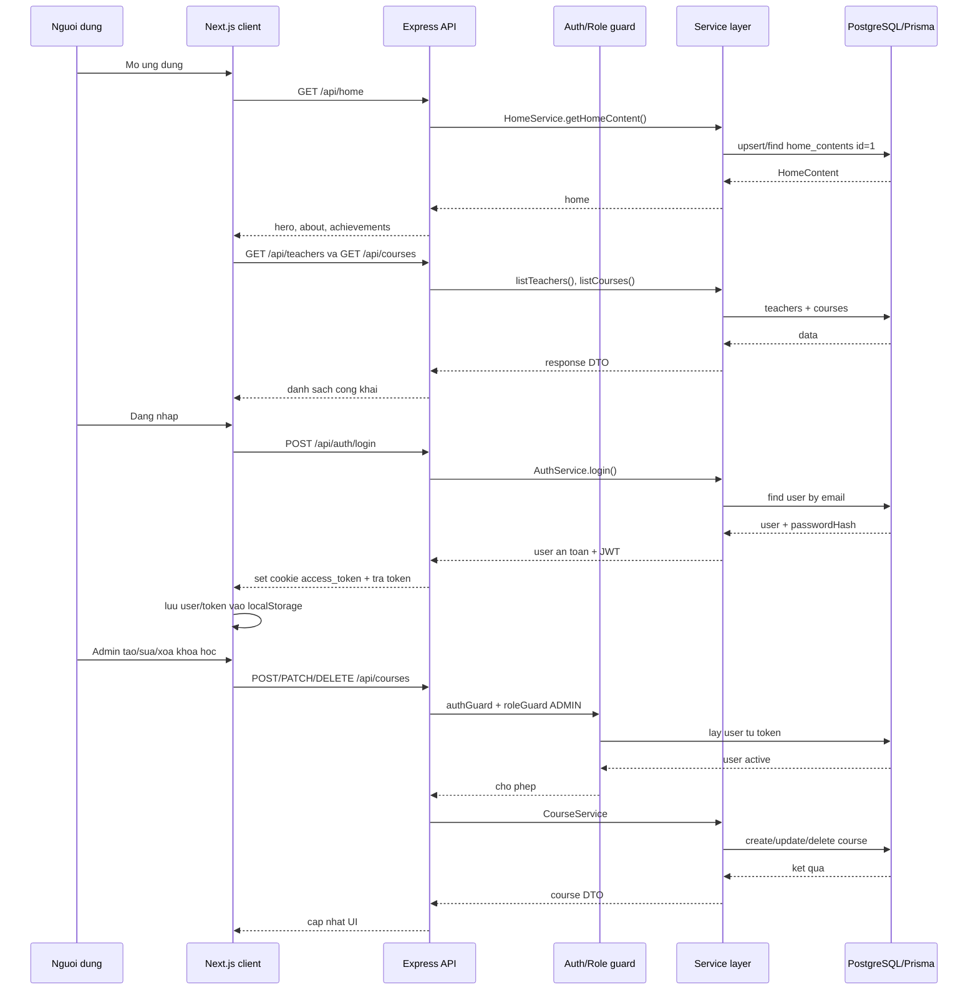
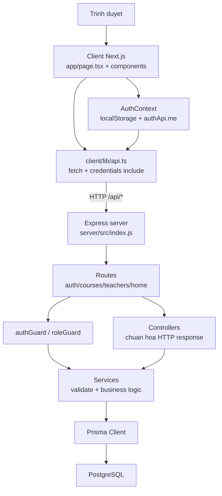

# So do use case va may trang thai he thong

Tai lieu nay tom tat luong hien tai cua du an "Lop Hoc So" dua tren folder `client/` va `server/`.

## Tong quan du an

- Frontend: Next.js/React trong `client/`.
- Backend: Express trong `server/`.
- Database: PostgreSQL qua Prisma.
- Auth: JWT, luu bang HTTP-only cookie `access_token`; frontend cung luu token/user trong `localStorage`.
- Role hien co: `STUDENT`, `TEACHER`, `ADMIN`.
- API that su hien co: auth, courses, teachers, home content.
- Cac tinh nang dang la mock/placeholder: quan ly hoc phi, tien thue phong, tai lieu lop hoc, dang ky khoa hoc/enrollment, dat phong, settings.

## So do use case

## So do may trang thai nguoi dung

## So do luong API hien tai

## So do kien truc thanh phan

## Bang API va trang thai tich hop

| Nhom | Endpoint | Quyen | Trang thai frontend |
| --- | --- | --- | --- |
| Auth | `POST /api/auth/signup` | Public | Da dung trong `LoginModal` |
| Auth | `POST /api/auth/login` | Public | Da dung trong `LoginModal` |
| Auth | `GET /api/auth/me` | Dang nhap | Da dung khi hydrate phien |
| Auth | `POST /api/auth/logout` | Public | Da dung khi dang xuat |
| Home | `GET /api/home` | Public | Da dung trong trang gioi thieu/hero |
| Home | `PATCH /api/home` | Admin | Da co nut sua JSON trong `AboutTab` |
| Courses | `GET /api/courses` | Public | Da dung trong `RoomsTab`, `TeachersTab` |
| Courses | `GET /api/courses/:id` | Public | Co wrapper, UI chua thay dung ro |
| Courses | `POST/PATCH/DELETE /api/courses` | Admin | `RoomsTab` co dung, `ManagementTab` chua dung |
| Teachers | `GET /api/teachers` | Public | Da dung trong `TeachersTab` |
| Teachers | `GET /api/teachers/:id` | Public | Co wrapper, UI chua thay dung ro |
| Teachers | `POST/PATCH/DELETE /api/teachers` | Admin | Da dung trong `TeachersTab` |

## Diem can luu y

- `ManagementTab` hien van dung `client/lib/mock-data.ts`, nen dashboard quan ly, hoc phi va tien phong chua ket noi database.
- `RoomsTab` va `TeachersTab` goi API admin ma khong truyen token vao tham so `token`; backend van co the xac thuc qua cookie HTTP-only neu cookie ton tai.
- Chua co bang/API enrollment, room booking, payment, document/file upload, user settings du da duoc ghi trong `NEEDAPI.md`.
- Hien schema Prisma moi co `User`, `Course`, `Teacher`, `HomeContent`.
